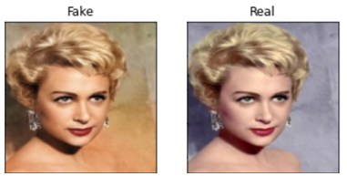
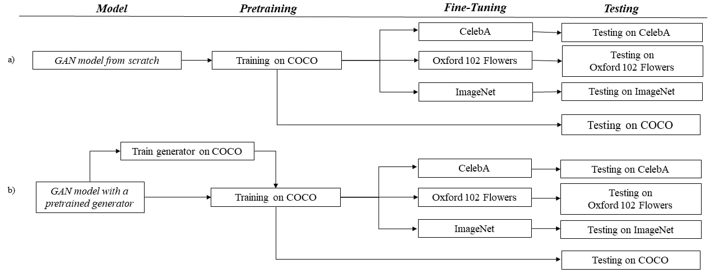
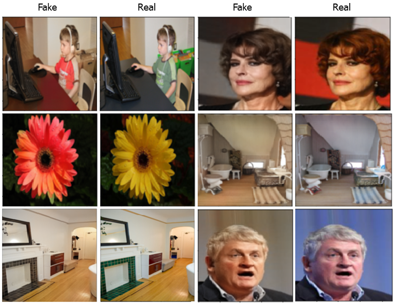
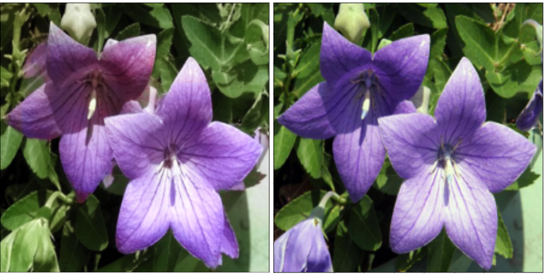

# Image Colorization Project using GANs 

Image colorization is a challenging problem with multiple plausible solutions. This project focuses on the implementation of Generative Adversarial Networks (GANs) for image colorization. Our experiments center around transfer learning using GANs, fine-tuning models on various datasets to achieve diverse levels of colorization for specific subjects like flowers or faces. This project was developed as part of the Vision And Cognitive Systems course at the University of Padua (2022).

## Report
You can read or download our project report here: [Image Colorization Project Report (PDF)](./Image_Colorization_using_GANs.pdf)

## Authors
- Sara Buttau (https://github.com/sbuttau)
- Salvatore Gatto (https://github.com/saso-gatto)
- 
# Table of Contents
1. [Key Features](#key-features)
2. [Training Details](#training)
3. [Example Images](#visual-results)
4. [Dependencies](#dependencies)
5. [License](#license)

## Key Features
- Transfer Learning
- Pretraining of Generator
- Cross-Validation on multiple Datasets
- Accurate Domain Selection
- Customized Loss Function
- Qualitative and Quantitative Result Analysis

## Usage
Notebooks for this project are provided and ready to run, developed on Google Colab. However, we do not provide pre-trained models.

## Training
We initially trained the GAN on COCO and fine-tuned it on Oxford102Flowers, CelebA, and ImageNet. 

We trained two GAN Models: 
a) GAN trained from scratch
b) GAN with pretrained generator on COCO

For both models, we fixed the following hyperparameters for training:
- Training on COCO for 180 epochs
- Mini-batch size: 16
- Learning rate: 2e-4
- Adam optimizer
- Lambda parameter: 100 for combining loss functions
- Validation set predictions monitored during training

For branch b), we pretrained the generator for 10 epochs on COCO before actual GAN training. Fine-tuning involved 50 epochs on each target dataset with a batch size of 8.

## Visual Results
Here are some visual examples of our models. 

## Dependencies
- [fast.ai](https://www.fast.ai/)
- [PyTorch](https://pytorch.org/)
- [NumPy](https://numpy.org/)

## License
This project is licensed under the MIT License.

